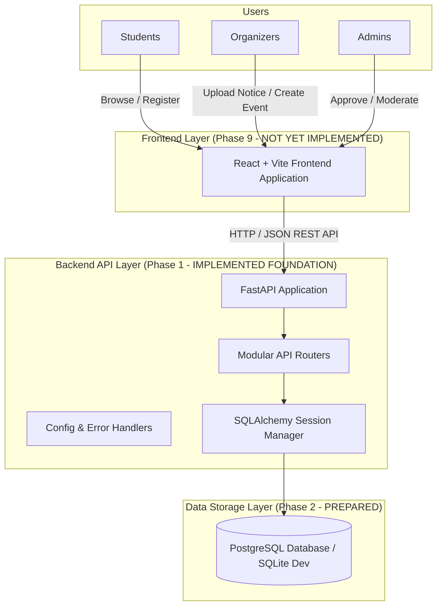
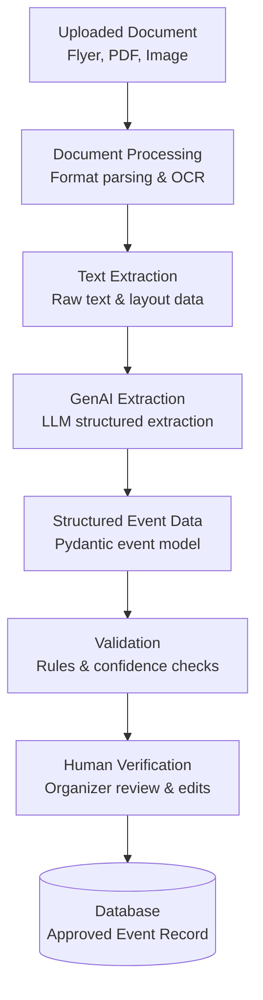
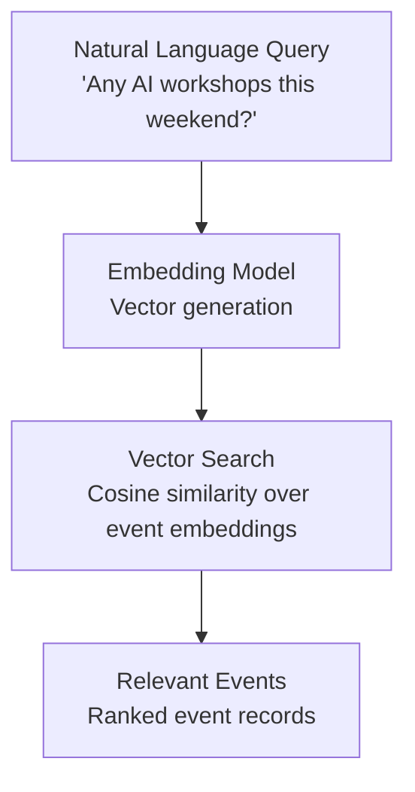

# System Architecture

This document describes the high-level architecture for the **Campus AI Event Discovery Platform**, including current baseline components and future planned pipelines.

---

## 1. High-Level System Architecture



### Component Status Summary
| Component | Technology | Current Status |
| :--- | :--- | :--- |
| **Backend Core & Routing** | FastAPI / Uvicorn / Pydantic | **Implemented (Phase 1)** |
| **Database Session Scaffolding** | SQLAlchemy 2.0 | **Implemented (Phase 1)** |
| **Database Schema & Migrations** | PostgreSQL / Alembic | *Planned (Phase 2)* |
| **Authentication & RBAC** | JWT / Passlib | *Planned (Phase 3)* |
| **Document Processing & Storage**| PDF/Image Parsers | *Planned (Phase 5)* |
| **GenAI Extraction Pipeline** | Modular LLM Adapter | *Planned (Phase 6)* |
| **Human Verification Layer** | Interactive Verification | *Planned (Phase 7)* |
| **Semantic / Vector Search** | Embeddings + Vector Store | *Planned (Phase 8)* |
| **Frontend Web Application** | React + Vite | *Planned (Phase 9)* |
| **Recommendation Engine** | Similarity Matching | *Planned (Phase 10)* |

---

## 2. GenAI Document Extraction Pipeline *(Planned - Phases 5–7)*

> **Status: NOT YET IMPLEMENTED (Scheduled for Phases 5–7)**

The diagram below outlines how unstructured event flyers and campus notices will be parsed and validated before persisting to the primary database:



### Pipeline Flow:
1. **Uploaded Document**: Organizer submits an event circular, poster, or PDF brochure.
2. **Document Processing**: Validates file types, sanitizes names, and handles storage.
3. **Text Extraction**: Uses OCR / PDF text extractors to extract textual content and coordinates.
4. **GenAI Extraction**: Prompts the LLM with structured schema constraints (JSON mode) to extract:
   - Event Title & Subtitle
   - Organizing Club / Department
   - Date, Start Time, End Time
   - Venue / Platform Link
   - Registration Link & Deadline
   - Eligibility & Entry Fee
5. **Validation**: Pydantic schema validation for dates, URLs, and required fields.
6. **Human Verification**: Organizer inspects the extracted fields side-by-side with the uploaded flyer and corrects any ambiguities.
7. **Database Persistence**: Once approved by the organizer, the event is saved as *Pending Approval* for campus administrators.

---

## 3. Semantic / RAG Search Pipeline *(Planned - Phase 8)*

> **Status: NOT YET IMPLEMENTED (Scheduled for Phase 8)**

The diagram below illustrates how students will search events using natural-language queries:



### Search Flow:
1. **Natural Language Query**: Student types a conversational search query.
2. **Embedding**: The query is converted into a high-dimensional vector.
3. **Vector Search**: Performs similarity comparison against stored event description embeddings.
4. **Relevant Events**: Returns matching events ranked by relevance, combined with categorical filtering (date, club, venue).

---

## 4. Current Phase 1 Directory Structure

```
campus-ai-event-platform/
│
├── backend/
│   ├── app/
│   │   ├── __init__.py           # Backend package root
│   │   ├── main.py               # FastAPI entry point, CORS, and root health check
│   │   ├── core/
│   │   │   ├── __init__.py
│   │   │   ├── config.py         # Application settings (Pydantic BaseSettings)
│   │   │   └── errors.py         # Central error and exception handlers
│   │   ├── models/
│   │   │   └── __init__.py       # Placeholder for Phase 2 database models
│   │   ├── schemas/
│   │   │   ├── __init__.py
│   │   │   └── health.py         # Pydantic schemas (HealthResponse)
│   │   ├── api/
│   │   │   ├── __init__.py
│   │   │   └── router.py         # Modular API router (/api/v1)
│   │   ├── services/
│   │   │   └── __init__.py       # Placeholder for business logic services
│   │   └── db/
│   │       ├── __init__.py
│   │       ├── base.py           # SQLAlchemy 2.0 DeclarativeBase
│   │       └── session.py        # Engine, SessionLocal, get_db dependency
│   │
│   ├── tests/
│   │   ├── __init__.py
│   │   └── test_health.py        # Pytest test suite for health endpoints
│   ├── requirements.txt          # Python dependencies
│   ├── .env.example              # Template environment variables
│   └── README.md                 # Backend documentation
│
├── frontend/
│   └── README.md                 # Frontend documentation (uninitialized)
│
├── ai-service/
│   └── README.md                 # AI service documentation (uninitialized)
│
├── docs/
│   ├── architecture.md           # System architecture & pipeline designs
│   ├── API.md                    # API specification and endpoints
│   └── development-plan.md       # Incremental 13-phase roadmap
│
├── .gitignore                    # Comprehensive ignore rules
└── README.md                     # Root project documentation
```
